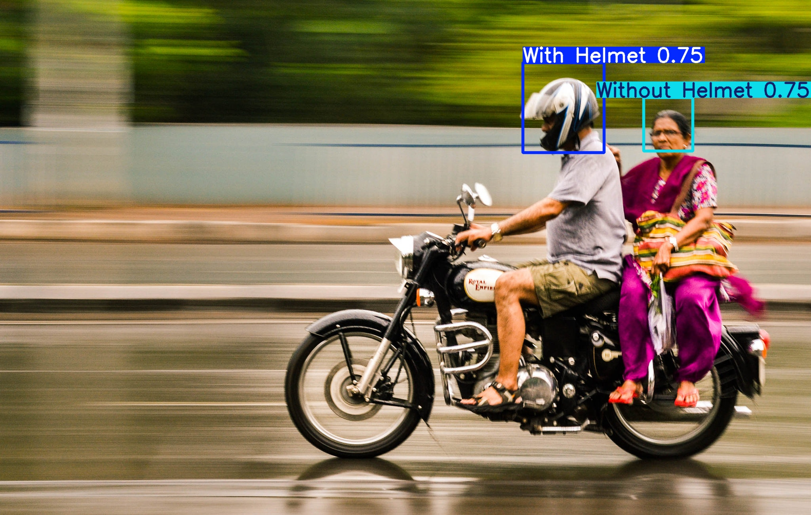

# Bike Helmet Detection ### using YOLO11 model

## Overview

This repository contains a YOLO-based bike helmet detection project using the [Ultralytics YOLO](https://github.com/ultralytics/ultralytics) framework. The model is trained to detect whether a person is wearing a helmet or not in images and video streams.

## Features

* Detects two classes: `With Helmet` and `Without Helmet`
* Training scripts leveraging Ultralytics YOLOv11
* Supports training, validation, and inference on both images and video
* Easy-to-follow setup and deployment

## Repository Structure

```
01.Bike_Helmet_Detection/
├── helmetDetectionDataset/       # Dataset directory
│   ├── test/                     # Training and validation images
|   ├── train/
|   ├── valid/
│   └── data.yaml                 # Paths and class definitions
├── media/                        # Sample test images/videos
├── mainPhoto.py                  # Inference on static images
├── mainVideo.py                  # Inference on video streams
├── train.py                      # Model training script
├── best.pt                       # Best trained weights (added after training)
├── requirements.txt              # Python dependencies
└── README.md                     # Project documentation
```

## Setup Instructions

Follow the steps below to get started with this project on your local machine.

### 1. Clone the Repository

```bash
git clone https://github.com/ManashR7488/Bick_Helmet_Detection-ML.git
cd 01.Bike_Helmet_Detection
```

### 2. Create and Activate a Virtual Environment

> **Windows**

```powershell
python -m venv venv
venv\\Scripts\\activate
```

> **macOS / Linux**

```bash
python3 -m venv venv
source venv/bin/activate
```

### 3. Install Python Dependencies

All required Python packages are listed in `requirements.txt`. Install them with:

```bash
pip install --upgrade pip
pip install -r requirements.txt
```

Alternatively, you can install core dependencies individually:

```bash
pip install ultralytics
pip install torch torchvision torchaudio --index-url https://download.pytorch.org/whl/cu118  # GPU support
pip install opencv-python numpy
```

### 4. Prepare the Dataset

1. Download or collect bike helmet images.
2. Organize under `helmetDetectionDataset/` in `test/`,`train/` and `valid/` subfolders.
3. Edit `helmetDetectionDataset/data.yaml` to point to your image folders and class names:

   ```yaml
   test : train/images
   train: train/images
   val: valid/images

   nc: 2
   names: ['With Helmet', 'Without Helmet']
   ```

## Training the Model

There are two ways to start training: via terminal (CLI) or by running the training script directly.

### 1. Terminal-based Training (CLI)

Run the training script using YOLOv11 weights as a base:

```bash
python train.py --model yolov11m.pt --data helmetDetectionDataset/data.yaml --epochs=50 --imgsz=640 --device=0
```

* `--model`: Path to the pretrained checkpoint (e.g., `yolov11m.pt`)
* `--data`: Path to your `data.yaml` configuration file
* `--epochs`: Number of training epochs (e.g., `50`)
* `--imgsz`: Input image size (e.g., `640`)
* `--device`: GPU device index (`0` for first GPU, or `cpu` for CPU)

### 2. File-based Training Script

You can also import and run training from `train.py` directly in Python:

```python
from ultralytics import YOLO

# Initialize model from pretrained YOLOv11 checkpoint
model = YOLO('yolov11m.pt')

# Start training
model.train(
    data='helmetDetectionDataset/data.yaml',  # dataset config
    epochs=50,                                # total epochs
    imgsz=640,                                # input image size
    device=0                                  # gpu index (use 'cpu' for CPU only)
)
```

After training completes, your best weights (`best.pt`) will be saved in the `runs/train/exp/weights/` directory by default.

## Running Inference

There are two ways to run inference: via terminal (CLI) or by using the inference scripts directly in Python.

### 1. Terminal-based Inference (CLI)

#### On Images

```bash
python mainPhoto.py \
  --weights runs/train/exp/weights/best.pt \
  --source media/test_image.jpg \
  --conf 0.25
```

#### On Video

```bash
python mainVideo.py \
  --weights runs/train/exp/weights/best.pt \
  --source media/test_video.mp4 \
  --conf 0.25
```

* `--weights`: Path to your trained weights (`best.pt`)
* `--source`: Path to input image or video file
* `--conf`: Confidence threshold (e.g., `0.25`)

### 2. File-based Inference Script

You can also import and run inference from `mainPhoto.py` or `mainVideo.py` directly in Python:

#### Image Inference

```python
from ultralytics import YOLO
import cv2

# Load your trained model
model = YOLO("best.pt")

# media path
media_path = "media/test2.jpg"

# Read your image
img = cv2.imread(media_path)

# Perform prediction
results = model.predict(source=img, imgsz=640, conf=0.5)

# Annotate results
results[0].show()  # Display the image with annotations
annotated = results[0].plot()
cv2.imwrite("annotated_image.jpg", annotated)
```

#### Video Inference

````python
from ultralytics import YOLO
import cv2

model = YOLO("best.pt")

cap = cv2.VideoCapture("test1.mp4")
fourcc = cv2.VideoWriter_fourcc(*'mp4v')
out = cv2.VideoWriter("output/videos/outvideo1.mp4", fourcc,
                      cap.get(cv2.CAP_PROP_FPS),
                      (int(cap.get(3)), int(cap.get(4))))

while cap.isOpened():
    ret, frame = cap.read()
    if not ret: break
    
    results = model.predict(source=frame, imgsz=640, conf=0.5)
    annotated = results[0].plot()
    out.write(annotated)

cap.release()
out.release()
````

Results (bounding boxes and labels) will be saved in `runs/detect/exp` by default. You can adjust confidence thresholds and output directories in the scripts.

## Sample Images

Below are examples of helmet detection in action.

| Normal image Example | After Detection Example |
|---------------------|------------------------|
|  |  |

## Sample Video
#### inputVideo
```` media/test1.mp4 ````

#### outputVideo


## Contributing

1. Fork the repository
2. Create a feature branch: `git checkout -b feature/my-feature`
3. Commit changes: `git commit -am 'Add my feature'`
4. Push to branch: `git push origin feature/my-feature`
5. Open a Pull Request

## License

This project is licensed under the Free License. See the [LICENSE](LICENSE) file for details.

---

